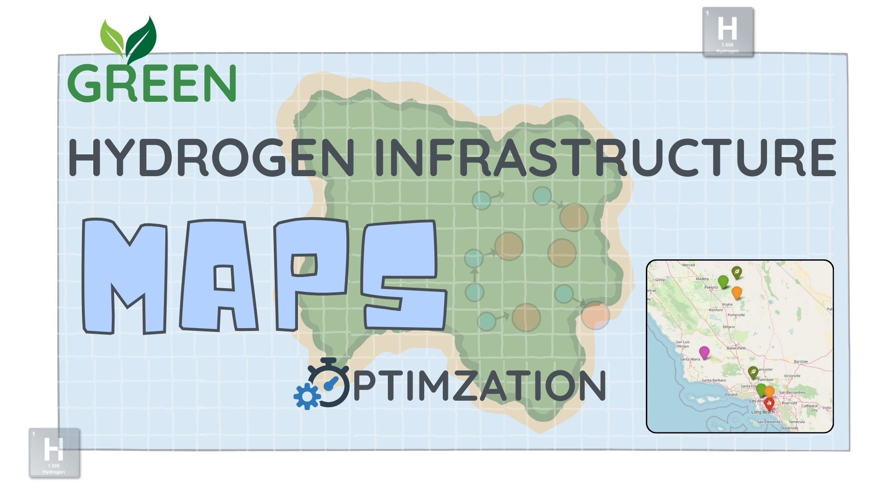
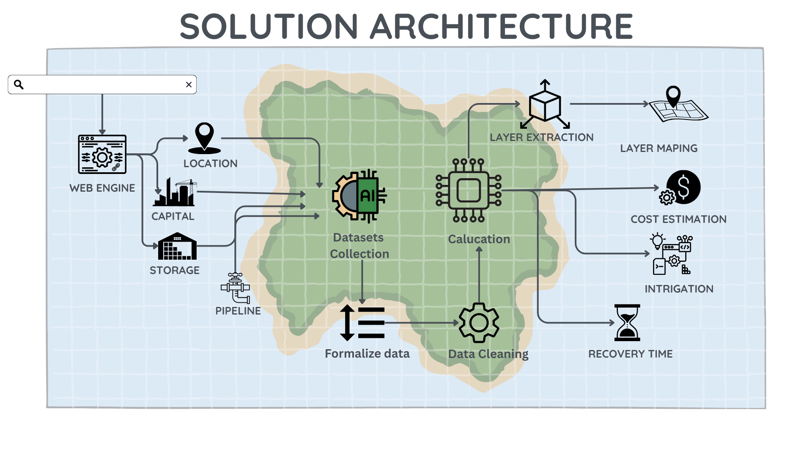
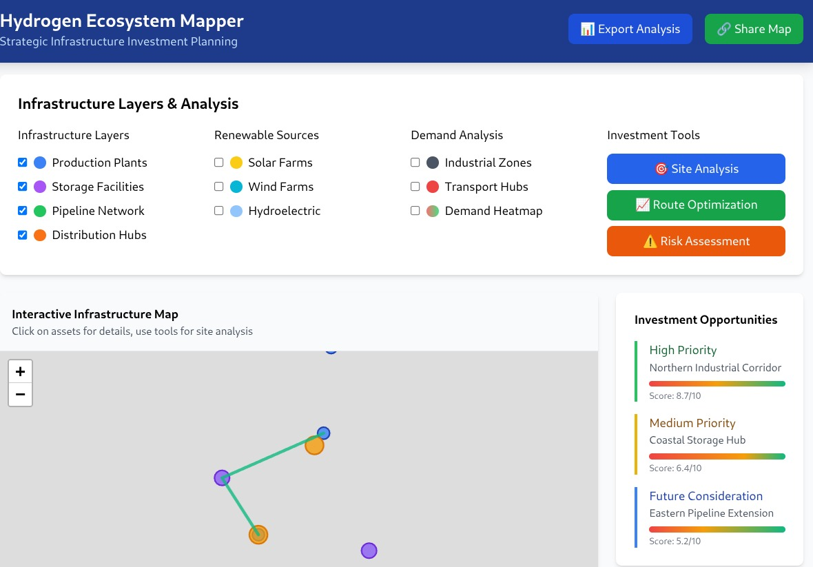
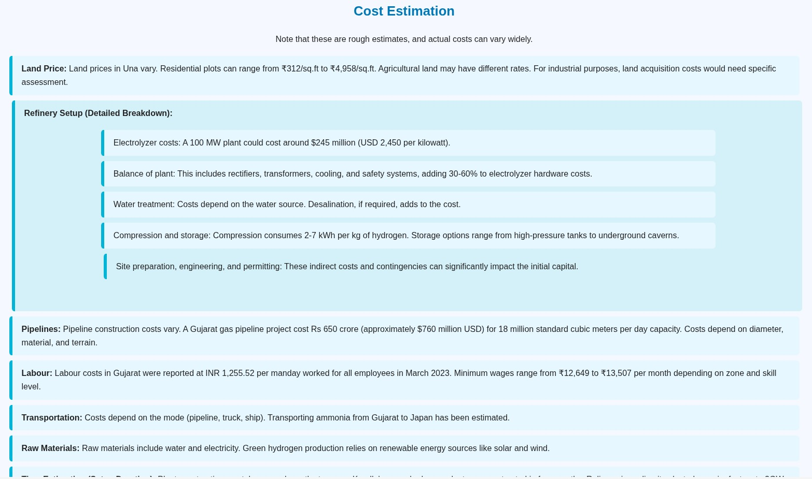
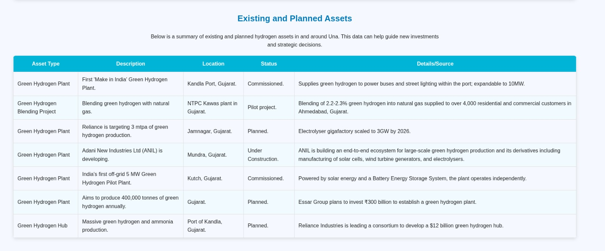

# 🌍 Green Hydrogen Infrastructure Map Optimization using AI Agent  

  
  
  
  

---

---

## 🎯 Our Solution  

We propose an **AI-powered, two-agent system** to **map existing infrastructure** and **recommend new hydrogen plant locations** with cost-benefit analysis.  

✨ **Key Idea**:  
- **Agent 1 (Data Collector)** → Fetches and aggregates data.  
- **Agent 2 (Recommender)** → Analyzes, maps, and generates actionable reports.  

## Architecutre 

**📌 Solution Architecture Explanation**

Inputs:

Web Engine – User interface to interact with the tool.

Location, Capital, Storage, Pipeline – Core datasets about infrastructure and resources.

Data Handling (Center):

- Datasets Collection – Collects all raw input data.

-  Formalize Data – Converts data into a structured format.

-  Data Cleaning – Removes errors, duplicates, and inconsistencies.

-  Calculation – AI/ML and geospatial models analyze demand, costs, and site suitability.

Outputs (Right Side):

-  Layer Extraction & Mapping – Generates interactive multi-layer maps of infrastructure, demand, and renewable energy.

-  Cost Estimation – Provides financial feasibility of projects.

-  Integration – Ensures alignment with existing networks and policies.

-  Recovery Time – Estimates how quickly investments will yield returns.

---

### 🚀 Key Benefits

✅ Data-driven insights for hydrogen plant investments

✅ Automated mapping using GIS & AI

✅ Comprehensive cost analysis with ROI & payback time

✅ Supports policymakers & investors with evidence-based planning

✅ Scalable to other renewable infrastructures (solar, wind, etc.) 

---

### 📊 Example Output (Mockup)

Sample Report Snippet

---

### 📌 Future Scope

🌐 Integration with real-time GIS datasets.

🔮 Advanced financial modeling & ROI simulation.

♻️ Expansion to multi-energy infrastructure (wind, solar, hybrid grids).

🤝 Collaboration with governments & private investors.

--- 

### 🛠️ Tech Stack (Planned)

Frontend: VanillaJs(Map visualization, dashboards)

Backend: FastAPI 

AI/Agents: Python (LangChain, LLMs)

Mapping: Leaflet

Datasets:-  MNRE / National Green Hydrogen Mission (NGHM), 

            PNGRB Data Bank

            data.gov.in / OGD Platform

--- 
### 📖 How to Use (Planned Steps)

**Clone the repo**

git clone https://github.com/ronyshahab/TeamRajdip.git

**Install dependencies**

pip install -r requirements.txt

**Run application**

python app.py

---

**🤝 Contributing**

Contributions are welcome! 🎉
Please open an issue or submit a pull request if you’d like to improve this project.

👨‍💻 Author
Parth Mahakal 

Ronak Singh